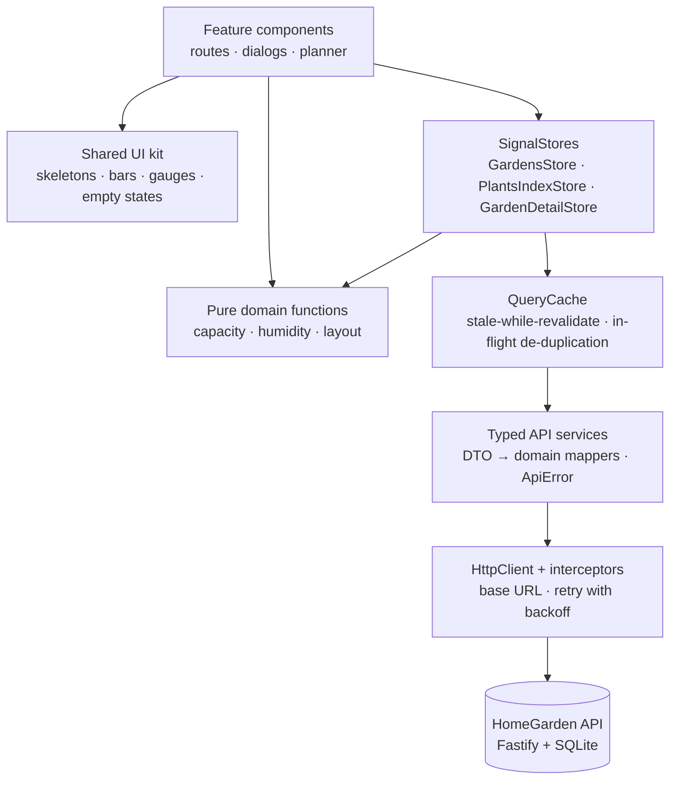
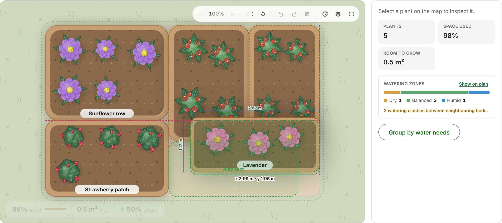

# 🌱 HomeGarden

An Angular 22 implementation of the In The Pocket Home Garden case. It covers the brief — gardens,
plants, target humidity and a capacity rule — with the focus on frontend architecture, reactive
state, a resilient experience on a deliberately slow and flaky API, accessibility, testing, and an
interactive planner that makes garden capacity visible.

Angular 22 · TypeScript · Signals · NgRx SignalStore · Angular Material 3 · RxJS · Nx · Vitest ·
Playwright


## The assignment and my approach

The case asks for:

- garden CRUD with a configurable target humidity (0–100);
- plant CRUD with all properties;
- one business rule: **the plants in a garden may never need more surface than the garden has**,
  validated with a clear message;
- a good experience on a backend that delays every response by 200–2000 ms and fails 10% of
  requests on purpose;
- useful tests and architecture documentation;
- as a bonus: a caching strategy for frequently used data, and an authentication design.

I treated it as a small production frontend rather than a CRUD exercise:

- **Explicit boundaries** — features never touch `HttpClient`, and the planner's renderer never owns
  business data.
- **Angular-native reactivity** — signals, `computed()`, SignalStore, zoneless change detection.
- **Domain logic outside components** — one pure implementation of the capacity rule, reused by
  every screen.
- **Latency as a design input** — skeletons, in-place mutation ghosts, retries and a cache instead of
  spinners.
- **Accessibility and tests for critical behaviour** from the start, not as a final pass.
- **Making capacity visible** — square metres are abstract, so the garden is drawn to scale.

Angular (instead of the suggested React meta-framework) was agreed with the team up front;
[ADR-001](docs/adr/ADR-001-angular-over-react.md) records why and maps the concepts for React
readers.

## What it does

**Profiles** — a welcome screen lists profiles and creates one inline; the active profile can be
edited, switched, signed out or deleted. The session survives a refresh and is revalidated on boot.
It is a profile session, not security — see [trade-offs](#deliberate-trade-offs).

**Dashboard** — a greeting with the portfolio in one line, KPI tiles (gardens, plants, m², utilisation),
a _Needs attention_ list (gardens at least 90% full, or drifting from their humidity target) and a
_Garden health_ grid with a small preview of each garden.

**Gardens** — create, edit and delete with name, surface, location and target humidity; search and
sort; a capacity bar and humidity target on every card; designed loading, empty, error and
not-found states.

**Plants** — create, edit and delete with name, species, type, plantation date, surface and ideal
humidity. The Add dialog opens on a catalog of 27 common plants ranked for _this_ garden (humidity
match, fit in the free area, variety); picking one only pre-fills the form, and custom plants are
first-class. A live _Garden fit_ panel shows available, required and remaining m² while you type.

**Garden planner** — the centre of Garden Detail; see [below](#the-garden-planner).

Light and dark themes; layouts from 375 to 1920 px.

| Dashboard                                    | Add a plant                                                      | Skeleton-first loading                                         |
| -------------------------------------------- | ---------------------------------------------------------------- | -------------------------------------------------------------- |
|  |  |  |

## Architecture



Arrows point from a layer to what it depends on, and they only point one way. Components read
signals and call store methods. Stores own server state and derive everything else through pure
functions. Only the API services know the backend's shapes, and only the interceptors know its
address. The shared UI kit is presentational — inputs in, outputs out; it never imports a feature, app state
or an API service.

That is what makes each layer testable on its own: domain functions without Angular, stores
against a stubbed API service, components through the real DOM.
([ARCHITECTURE.md](docs/architecture/ARCHITECTURE.md))

## Angular 22 decisions

- **Zoneless + OnPush.** Angular 22 is zoneless by default and `zone.js` is not installed. Change
  detection runs only where a signal changed, which keeps the planner cheap and makes every reactive
  dependency explicit.
- **Signals and `computed()`.** Used and free area, occupancy, humidity drift and the planner's view
  model are all `computed()` from pure functions, so they are never duplicated as writable state that
  could drift from the data.
- **`linkedSignal()`** where local UI state must reset when its source changes — the planner's
  "cannot regroup" notice clears whenever the plant set changes.
- **Signal inputs and outputs, `inject()`.** Components declare `input()`, `input.required()` and
  `output()`; dependencies are injected at field level.
- **Built-in control flow and `@defer`.** The planner ships in its own
  `@defer (on viewport; prefetch on idle)` chunk behind a placeholder of the same size.
- **Standalone components and lazy routes.** Each feature is a route and a chunk; route changes use
  view transitions.
- **Typed Reactive Forms** (`NonNullableFormBuilder`), with limits that mirror the backend's zod
  schemas.
- **Angular Material 3**, themed through design tokens. Dialogs, menus, selects and form fields come
  from Material for their accessibility; cards, bars, gauges and the planner are built in
  `shared/ui`.

## State management

| State                | Lives in                                            | Examples                                                                     |
| -------------------- | --------------------------------------------------- | ---------------------------------------------------------------------------- |
| Server / domain      | NgRx SignalStore                                    | the garden list, plants per garden, the open garden                          |
| Derived              | `computed()` over pure functions                    | used area, free area, occupancy, attention flags                             |
| Local interaction    | component signals                                   | dialog state, the selected plant, search text                                |
| Async orchestration  | store methods; `rxMethod` where a stream earns it   | load, save and delete; `ensureForGardens` reacts to a _signal_ of garden ids |
| Planner presentation | the planner feature and a `localStorage` repository | camera, layers, undo history, bed positions                                  |
| App-wide UI          | plain signal services                               | session, theme, toasts                                                       |

There are three stores, each with one job: `GardensStore` holds the garden list,
`PlantsIndexStore` is the single writable owner of plant entities (shared by the dashboard, the
gardens grid and Garden Detail), and `GardenDetailStore` holds the open garden and its pending
mutations.

**Why SignalStore rather than the classic NgRx Store:** three stores with CRUD-shaped flows. SignalStore
gives explicit ownership — state is read-only from outside and written only through store methods —
derived state through `withComputed`, and signals that templates read directly, without actions,
reducers and effects for flows that do not need an event log. The classic Store earns its place when
many teams share cross-cutting state or need action-level tooling.
([ADR-002](docs/adr/ADR-002-signalstore.md))

## The business rule

```text
Σ plant.surfaceAreaRequired  ≤  garden.totalSurfaceArea
```

One implementation, in `domain/garden-insights/garden-insights.ts`, serves the plant form's validator and its
live _Garden fit_ panel, the stores' occupancy figures, the dashboard and the planner. It follows
the server's semantics:

- **an exact fit is accepted** — a plant that takes the last square metre is fine; only _more_ than
  the garden has is rejected;
- **an edit excludes the plant's own current area**, so changing a plant never double-counts it;
- **decimal areas** (0.3 m²) are supported and shown with fixed digits, so sums never display float
  noise;
- **the remaining area** is shown live, before submit.

The backend stays authoritative: its 400 verdict is rendered inline in the form, word for word.
`PUT /gardens/{id}` has no server-side capacity check, so the client warns before a garden is
shrunk below what is planted in it.

## Designing for a slow, flaky API

Latency is part of the case, not an edge case, so the UI is built around it.

| Operation     | UX treatment                                                                                 |
| ------------- | -------------------------------------------------------------------------------------------- |
| Read (cold)   | a content-shaped gray skeleton, shown only after 150 ms, reserving the final layout          |
| Read (cached) | fresh data renders instantly; stale data renders instantly and revalidates in the background |
| Create        | a creation ghost where the new card, table row or bed will appear                            |
| Update        | only the edited element becomes a ghost; the rest of the screen stays live                   |
| Delete        | the item stays visible and inert until the server confirms, then leaves                      |
| Submit        | single-flight, with a gray ghost bar inside the button                                       |

- **No spinners** — enforced by `npm run check:no-spinners` and asserted in the e2e suite.
- **One skeleton engine** (`styles/_skeleton.scss`) owns the look and timing of every ghost: neutral
  gray, one shimmer, and a gentle pulse instead under reduced motion.
- **Feedback stays local** to the affected region, and numbers never show a partial or invented
  value.
- **Writes are confirmed, not optimistic.** The capacity rule lives on the server, so the screen
  shows the server's answer; a failed write turns the ghost back into real content with _Try again_.
- **Accessible:** ghosts are hidden from assistive technology, busy regions carry `aria-busy`, and a
  polite status region announces loading.

([ASYNC-UX.md](docs/design/ASYNC-UX.md))

### Beyond the happy path

Transient 5xx and network errors are retried up to three times with exponential backoff and full
jitter — never a 4xx verdict — which takes a three-request screen from about 27% visible failures to
under 0.1%. Whatever still fails is classified once, by `toApiError`, and rendered in exactly one way:

- **validation and business errors** → inline in the form, never retried;
- **not found** → a designed page for a deep link to a deleted garden, or a quiet sign-out for a
  deleted profile;
- **technical errors** → an error state or a toast with _Try again_;
- **empty data** → a designed empty state with the next action.

Double submits are ignored, a late response for one garden can never overwrite another (each load
carries a monotonic token), and mutations keep the cache consistent by writing through what the
server returned. Per-endpoint detail: [API-INTEGRATION.md](docs/architecture/API-INTEGRATION.md).

## The garden planner

Square metres are abstract. "19.5 of 20 m² used" is a number; a garden drawn to scale with almost no
open soil left is something you understand at a glance. So Garden Detail centres on a top-down plan
where **each bed's drawn area is exactly its real m²** and the open soil is exactly the free area —
a 98%-full garden _looks_ 98% full.

```text
GardenDetailStore (garden, plants)
        ↓
pure layout: squarified treemap + saved positions  →  view model (rectangles in metres)
        ↓
SVG template — the only code that knows it is SVG
```

The renderer owns UI state only — camera, selection, layers. Capacity comes from the domain
functions, and dragging a bed can never change an area or call the API.

- an area-true automatic layout that is deterministic, so reopening a garden never rearranges it;
- pan, zoom (wheel, pinch, toolbar), fit and reset;
- select a bed on the plan or in the plants table; an inspector shows its details, watering zone and
  actions;
- drag beds with alignment guides and a magnet back to their automatic spot, or move them with the
  keyboard; undo and redo;
- layers for labels, footprints, grid, humidity preference, watering zones and available space;
- watering zones with neighbour-clash hints, _Group by water needs_, and a planting timeline;
- fullscreen with search;
- positions saved per garden in versioned `localStorage` — visual preferences only.



### Why SVG

|                   | SVG (chosen)                 | Canvas 2D               | PixiJS / WebGL               |
| ----------------- | ---------------------------- | ----------------------- | ---------------------------- |
| Suited to         | tens to a few thousand nodes | any scene               | tens of thousands of sprites |
| Added bundle (gz) | 0 kB                         | 0 kB                    | ~100–140 kB                  |
| Accessibility     | real, focusable DOM nodes    | needs a parallel DOM    | needs a parallel DOM         |
| Design tokens     | native CSS variables         | colour bridge + repaint | colour bridge + repaint      |
| Testing           | jsdom and real nodes         | pixel inspection        | pixel inspection             |

A garden holds tens of beds, so SVG gives the same visual quality without a rendering engine's costs,
and every bed is a real button that keyboard users and axe can reach. If the planner ever had to
animate thousands of entities, WebGL would be worth reconsidering — and because the renderer depends
only on the layout view model and camera state, swapping it would mean rewriting one template, not the
domain, stores or layout maths. ([ADR-007](docs/adr/ADR-007-garden-visualization-engine.md),
[INTERACTIVE-GARDEN-UX.md](docs/design/INTERACTIVE-GARDEN-UX.md))

## Backend integration

- **`apps/api`** is the case's Fastify + Kysely + SQLite API, kept as provided apart from one
  additive change: gardens gained `targetHumidityLevel`
  ([ADR-003](docs/adr/ADR-003-backend-extension.md)). Swagger UI is served at `/docs`.
- **`bruno/`** is the provided Bruno collection for calling every endpoint by hand (environment:
  _Development server_).
- **Typed data access** — API services return domain models through pure DTO mappers, and a single
  `toApiError` classifies every failure as `technical`, `functional` or `not-found`.
- The API's latency and 10% failure rate are switched on by design (`plugins/slow-api.ts`,
  `plugins/random-errors.ts`), and the frontend treats them as the normal case rather than an
  exception.

## Testing

Coverage follows risk: the most tests sit where a bug would hurt most.

| Layer                     | What it proves                                                                                                              | Runner           |
| ------------------------- | --------------------------------------------------------------------------------------------------------------------------- | ---------------- |
| Domain                    | capacity and humidity maths, DTO mapping, planner layout and camera maths                                                   | Vitest           |
| Stores and infrastructure | state transitions, cache and retry behaviour under fake timers, error classification                                        | Vitest           |
| Components                | what a user notices, through the real DOM: skeleton → data → empty or error, inline verdicts                                | Vitest + TestBed |
| Playwright, mocked        | what randomness cannot guarantee: exact delays, persistent 500s, failing mutations, planner interaction, layouts, axe scans | Playwright       |
| Playwright, integration   | the core flows against the real slow, flaky API — retry layer included                                                      | Playwright       |

Supporting numbers: 721 Vitest tests in 51 files, 71 mocked and 6 integration Playwright tests, and
a 95% threshold on statements, branches, functions and lines.

Some of the tests that matter most:

- _blocks an over-capacity plant client-side with a clear message and never calls the API_
- _accepts a plant that exactly fills the garden (strict > rule, mirroring the server)_
- _excludes the plant itself when editing_ — and, against the real API, _editing a plant does not
  double-count its own area_
- _is single-flight: a second click while saving is ignored_
- _discards a stale FAILURE too — an old error must not blank a newer garden_
- _a DELETE that keeps failing: ghost while retried, then the plant is back with a retry_
- _initial GET shows a content-shaped gray skeleton — never a spinner — then the real layout_
- _dragging a bed moves it, survives reload, and Reset layout restores auto-arrangement_
- long-content checks that no page scrolls sideways at 375, 768, 1024, 1440 or 1920 px

([TESTING-STRATEGY.md](docs/architecture/TESTING-STRATEGY.md))

## Performance

The frontend cannot make this API faster. It can avoid calling it, ship less code, and make waiting
readable — and those are different things:

- **Fewer requests** — a 30-second stale-while-revalidate cache serves repeat visits with zero
  requests, identical in-flight reads collapse into one, and hovering a garden card prefetches its
  detail.
- **Less code up front** — about 133 kB of JavaScript transferred on first load (gzip). Every route
  is lazy, and the planner is a separate ~19 kB chunk behind `@defer`. Budgets in `angular.json` fail
  the build on regression.
- **Perceived speed** — skeletons and ghosts do not shorten the wait; they make it stable and legible,
  with no layout shift when data lands.
- **Assets** — the decorative backdrop is responsive WebP (800 and 1600 px), plant artwork is inline
  SVG, and fonts are self-hosted.

([PERFORMANCE-AND-CACHING.md](docs/architecture/PERFORMANCE-AND-CACHING.md))

## Accessibility

Designed toward WCAG 2.2 AA expectations:

- native buttons and links, one `h1` per page, landmarks, a skip link, and a visible focus ring
  everywhere;
- dialogs from the Material CDK, with focus trapped inside and restored on close;
- a keyboard-operable planner: every bed is a labelled button, arrow keys move a bed as the
  alternative to dragging, and each move is announced;
- state never relies on colour alone, and every animation respects `prefers-reduced-motion`;
- axe scans in both themes run in the Playwright suite and fail it on serious or critical issues.

([ACCESSIBILITY.md](docs/architecture/ACCESSIBILITY.md))

## Project structure

```text
apps/
├── api/        the provided Fastify + SQLite backend
├── web/        the Angular application
│   └── src/app/
│       ├── core/       API client, interceptors, cache, errors, session, shell
│       ├── state/      app-wide SignalStores, one folder each
│       ├── domain/     business rules and maths, one folder per module
│       ├── features/   one folder per screen: onboarding, dashboard, gardens,
│       │               garden-detail (with the planner), profile, not-found —
│       │               the page at its root, every other unit in its own folder
│       └── shared/ui/  presentational components, one folder each
└── web-e2e/    Playwright: integration and mocked projects
bruno/          API collection
docs/           architecture notes, ADRs, design notes, screenshots, walkthrough deck
tools/          spinner check, production preview server
```

## Getting started

Requires Node 22.22.3+ or 24.15+ (the Angular CLI's minimum) and npm.

```bash
npm ci
npm run dev
```

`npm run dev` starts the API and the web app together; `npm run dev:api` and `npm run dev:web` start
them in separate terminals.

|                       | URL                        |
| --------------------- | -------------------------- |
| Web app               | http://localhost:4200      |
| API                   | http://localhost:3000      |
| API docs (Swagger UI) | http://localhost:3000/docs |

A fresh clone starts with an empty SQLite database (`db.sqlite`, created on first boot): create a
profile, then a garden.

### Checks

| Command                                                                          | Purpose                                                    |
| -------------------------------------------------------------------------------- | ---------------------------------------------------------- |
| `npm run lint`                                                                   | ESLint and Prettier for api, web and web-e2e               |
| `npm run typecheck`                                                              | strict TypeScript with `strictTemplates`                   |
| `npm run test`                                                                   | Vitest unit and component tests                            |
| `npm run test:coverage`                                                          | the same, enforcing the 95% thresholds                     |
| `npx playwright test -c apps/web-e2e/playwright.config.ts --project=mocked`      | deterministic Playwright suite (starts the apps if needed) |
| `npx playwright test -c apps/web-e2e/playwright.config.ts --project=integration` | the core flows against the real API                        |
| `npm run test:e2e`                                                               | both Playwright projects                                   |
| `npm run build`                                                                  | production builds of api and web, with bundle budgets      |
| `npm run check:no-spinners`                                                      | fails if a spinner appears anywhere in the app             |

## Production build

```bash
npm run build:web                      # → apps/web/dist/web/browser
node tools/serve-dist.mjs --port 4300  # preview the build the way a static host serves it
```

The build is AOT-compiled and content-hashed, without source maps. The app calls a relative `/api`
base URL (set in `src/environments/`), so production expects the SPA and a reverse proxy for
`/api/*` on the same origin — the dev server does the same through `proxy.conf.json`. A host must
also fall back to `index.html` for client-side routes. There is no deployed environment; hosting
requirements and recommended security headers are in
[PRODUCTION-READINESS.md](docs/PRODUCTION-READINESS.md).

## Deliberate trade-offs

- **SignalStore over the classic NgRx Store** — less ceremony for three stores, with the same
  explicit ownership and derived state.
- **SVG over Canvas or WebGL** — right for tens of beds and for accessibility; the renderer boundary
  keeps WebGL an option.
- **Client-side rendering, no SSR** — the app sits behind a profile session and has no public,
  indexable content.
- **Confirmed writes, not optimistic ones** — a little slower to feel, but every number on screen is
  one the server agreed to.
- **Planner positions as UI state** — the API has no coordinates, so positions live in versioned
  `localStorage` and never influence capacity.
- **A local plant catalog behind a provider seam** — no API keys or third-party availability on the
  critical path; an external source would be another provider behind the same interface.
- **`1 + N` requests on the dashboard** — the API has no aggregate endpoint; the calls run in
  parallel, cached and individually retried.
- **A profile session, not authentication** — the production design is written up instead
  ([ADR-005](docs/adr/ADR-005-authentication.md)).

## What I would do next

- **Real authentication** — OIDC through a small backend-for-frontend with httpOnly session cookies
  and owner-scoped data ([ADR-005](docs/adr/ADR-005-authentication.md)).
- **A server-side read model for the dashboard** (gardens with plant totals), plus `ETag`s so
  revalidation is nearly free.
- **Planner layouts stored by the API**, so they follow the user across devices.
- **Playwright in CI, and telemetry** (Web Vitals, error reporting) behind the existing logging seam.
- **Richer plant data** from an external catalog, behind the existing provider seam.

## Further documentation

| Topic                                            | Document                                                                   |
| ------------------------------------------------ | -------------------------------------------------------------------------- |
| Architecture, state, errors, conventions         | [ARCHITECTURE.md](docs/architecture/ARCHITECTURE.md)                       |
| API audit and per-endpoint UX states             | [API-INTEGRATION.md](docs/architecture/API-INTEGRATION.md)                 |
| Caching, request ownership, latency measurements | [PERFORMANCE-AND-CACHING.md](docs/architecture/PERFORMANCE-AND-CACHING.md) |
| Testing strategy                                 | [TESTING-STRATEGY.md](docs/architecture/TESTING-STRATEGY.md)               |
| Accessibility                                    | [ACCESSIBILITY.md](docs/architecture/ACCESSIBILITY.md)                     |
| Async UX contract                                | [ASYNC-UX.md](docs/design/ASYNC-UX.md)                                     |
| Planner interaction design                       | [INTERACTIVE-GARDEN-UX.md](docs/design/INTERACTIVE-GARDEN-UX.md)           |
| Design system                                    | [DESIGN-SYSTEM.md](docs/design/DESIGN-SYSTEM.md)                           |
| Build, hosting, dependencies                     | [PRODUCTION-READINESS.md](docs/PRODUCTION-READINESS.md)                    |
| Architecture decisions                           | [ADR-001 … ADR-007](docs/adr/)                                             |

A walkthrough deck is in [docs/presentation/home-garden-demo.html](docs/presentation/home-garden-demo.html)
(open it locally in a browser).

## Credits

- **Plant artwork** — the eight top-down botanical symbols
  (`apps/web/src/app/shared/ui/plant-visuals/plant-artwork-defs.ts`) are original vector artwork
  made for this project; no icon packs or stock images.
- **Backdrop** — `apps/web/public/images/garden-backdrop-{800,1600}.webp` is the illustration from
  the case assignment document, re-encoded to WebP; decorative only.
- **Fonts** — Inter and Sora (SIL Open Font License 1.1), self-hosted through `@fontsource-variable`;
  their licences ship in the build's `3rdpartylicenses.txt`.

Nothing is fetched from a third-party network at runtime.

AI tooling was used as a pair programmer for scaffolding and iteration, per the case's AI policy.
Every decision and trade-off above is documented and owned.
