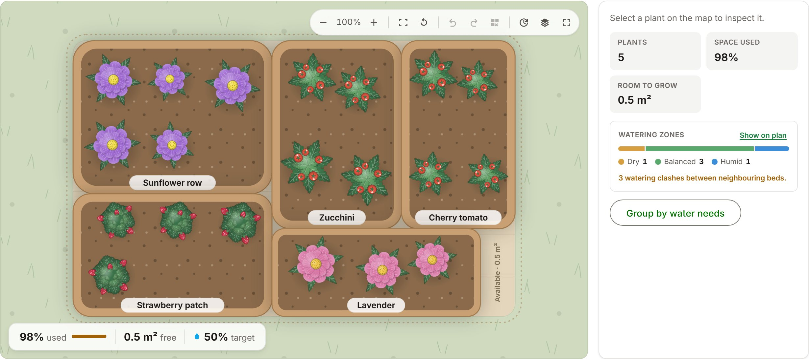
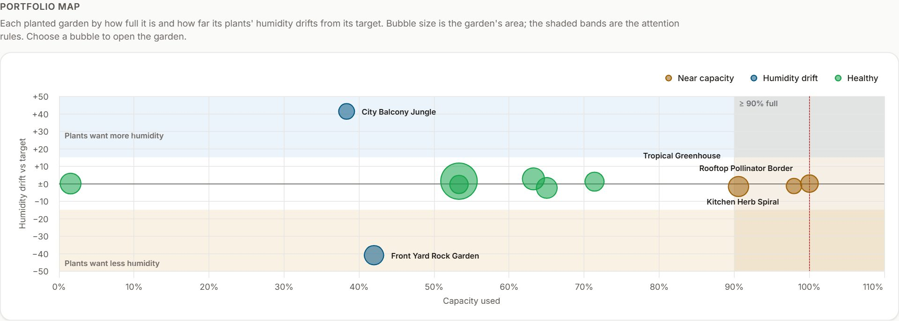
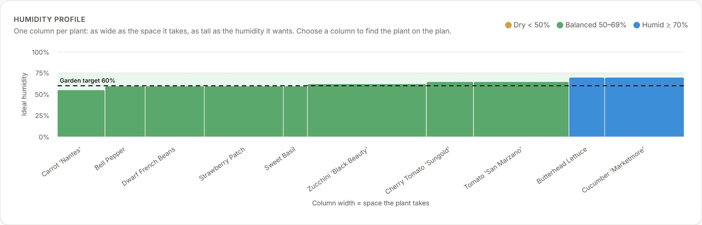
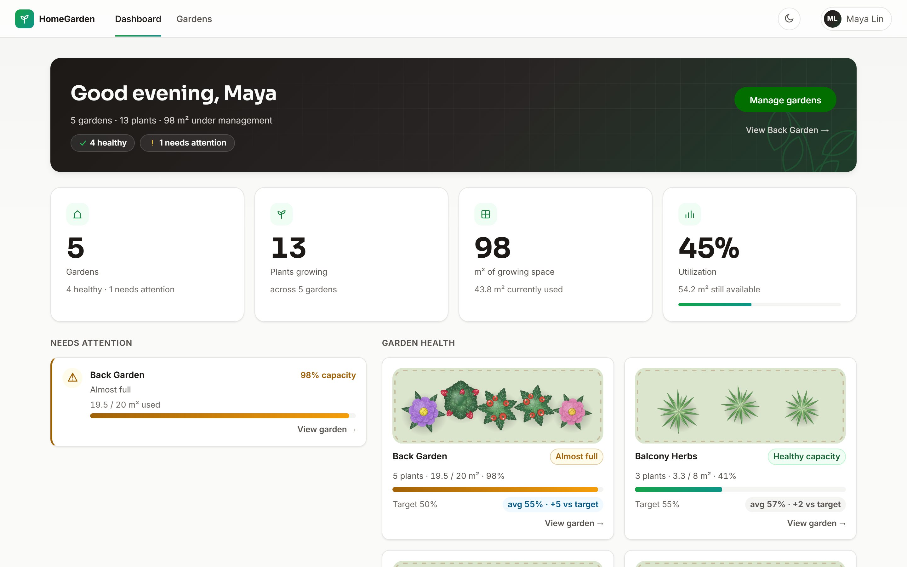
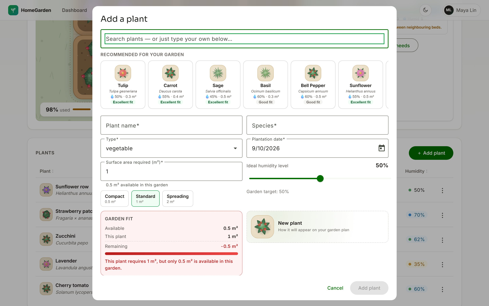
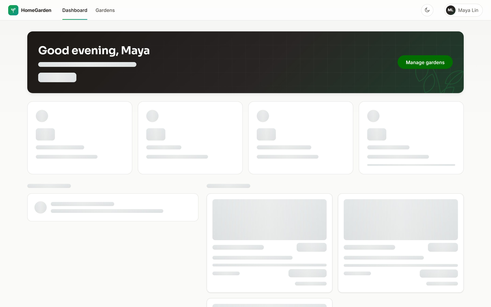
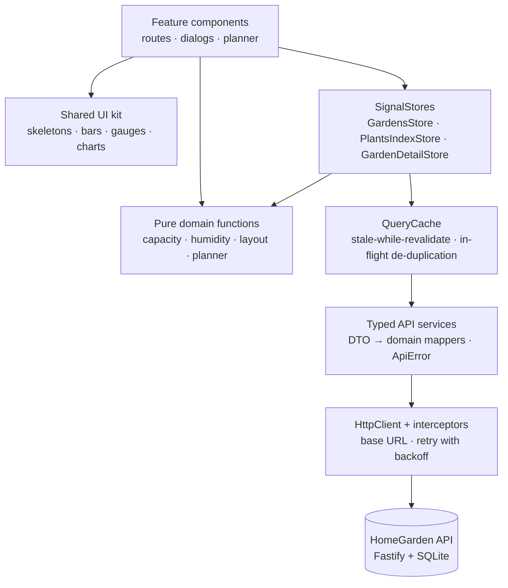
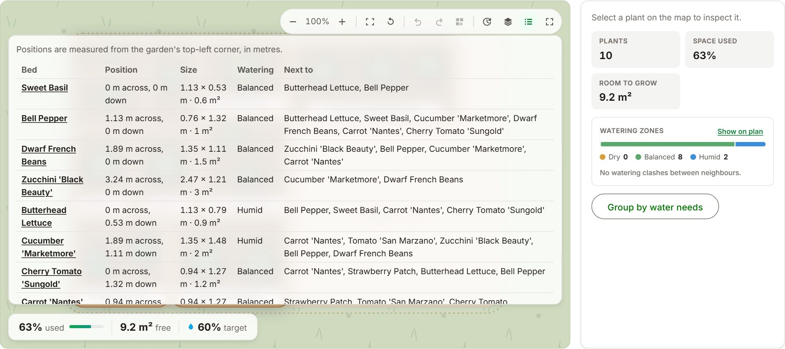

# 🌱 HomeGarden

[](https://github.com/Liviu29/home-garden-case/actions/workflows/ci.yml)

An Angular 22 implementation of the In The Pocket Home Garden case — gardens, plants, target
humidity and a capacity rule — built as a small production frontend on a deliberately slow and flaky
API: frontend architecture, reactive state, resilience, accessibility, testing, and an interactive
planner that makes garden capacity visible.

Angular 22 · TypeScript · Signals · NgRx SignalStore · Angular Material 3 · RxJS · Highcharts ·
Nx · Vitest · Playwright



## The 60-second tour

1. **Run it** — `npm ci && npm run dev`, open http://localhost:4200, create a profile, then a
   garden ([setup](#getting-started)).
2. **Dashboard** — the portfolio in one line, KPI tiles, a _Needs attention_ list and a _portfolio
   map_: every planted garden by how full it is and how far its plants' humidity drifts from its
   target, with the attention rules drawn as bands. Choose a bubble to open that garden. At the
   bottom, _Water today_ lists the beds to water, by garden and watering zone.
3. **A garden** — the planner draws each bed at its real m², so a 98%-full garden _looks_ 98% full.
   Drag beds, regroup them by water needs, replay the planting timeline, or read the same plan as a
   list.
4. **Its humidity profile** — one column per plant, as wide as the space it takes and as tall as the
   humidity it wants, against the garden's target. Choose a column to find the plant on the plan.
5. **The rule** — add a plant that does not fit: the form says so while you type, and the server
   agrees. Shrinking a garden below its plants is refused too.
6. **The hostile API** — every response takes 200–2000 ms and one in ten fails on purpose. You see
   skeletons and gray ghosts instead of spinners, and retries you never have to press.

| Portfolio map (dashboard)                                                                 | Humidity profile (garden)                                                                  |
| ----------------------------------------------------------------------------------------- | ------------------------------------------------------------------------------------------ |
|  |  |

## The assignment and my approach

The case asks for garden CRUD with a configurable target humidity (0–100), plant CRUD with all
properties, and one business rule — **the plants in a garden may never need more surface than the
garden has** — on a backend that delays every response by 200–2000 ms and fails 10% of requests,
with useful tests and architecture documentation. Bonus: caching and an authentication design.

I treated it as a small production frontend rather than a CRUD exercise:

- **Explicit boundaries** — features never touch `HttpClient`; the planner's renderer never owns
  business data.
- **Angular-native reactivity** — signals, `computed()`, SignalStore, zoneless change detection.
- **Domain logic outside components** — one pure implementation of the capacity rule, reused by
  every screen.
- **Latency as a design input** — skeletons, in-place mutation ghosts, retries and a cache, not
  spinners.
- **Accessibility and tests for critical behaviour** from the start.

Angular (instead of the suggested React meta-framework) was agreed with the team up front;
[ADR-001](docs/adr/ADR-001-angular-over-react.md) records why and maps the concepts for React readers.

## What it does

- **Profiles** — a welcome screen lists profiles and creates one inline; the active profile can be
  edited, switched, signed out or deleted. Each profile sees its own gardens plus the shared ones
  ([ADR-009](docs/adr/ADR-009-garden-ownership.md)). The session survives a refresh and is revalidated on boot
  (a profile session, not security — see [trade-offs](#deliberate-trade-offs)).
- **Dashboard** — greeting, KPI tiles, _Needs attention_ (gardens at least 90% full or drifting from
  their humidity target), a _Garden health_ grid with a preview of each garden, the portfolio
  map, and _Water today_: which beds need water, by garden and watering zone, worked out from each
  plant's zone and planting date.
- **Gardens** — create, edit and delete with name, surface, location and target humidity; search
  and sort; a capacity bar on every card; designed loading, empty, error and not-found states. A
  deleted garden or plant can be brought back from the toast's _Undo_.
- **Plants** — create, edit and delete with every property. The Add dialog opens on a catalog of 27
  common plants ranked for _this_ garden; picking one only pre-fills the form, and a live _Garden
  fit_ panel shows available, required and remaining m² while you type.
- **Garden planner** and **humidity profile** — the centre of Garden Detail; see
  [below](#the-garden-planner). The plan, the humidity profile and the portfolio map each save
  as a PNG, drawn in the browser.

Light and dark themes; layouts from 375 to 1920 px.

| Dashboard                                    | Add a plant                                                      | Skeleton-first loading                                         |
| -------------------------------------------- | ---------------------------------------------------------------- | -------------------------------------------------------------- |
|  |  |  |

## Architecture



Arrows point from a layer to what it depends on, and only one way. Components read signals and call
store methods; stores own server state and derive everything else through pure functions; only the
API services know the backend's shapes, and only the interceptors know its address. The shared UI
kit is presentational — inputs in, outputs out. That is what makes each layer testable on its own.
([ARCHITECTURE.md](docs/architecture/ARCHITECTURE.md))

## Angular 22 decisions

- **Zoneless + OnPush** — change detection runs only where a signal changed.
- **Signals and `computed()`** — used and free area, occupancy, humidity drift and the planner's
  view model are derived, never stored where they could drift from the data; `linkedSignal()` where
  local UI state must reset with its source.
- **Signal inputs/outputs and `inject()`** throughout.
- **Built-in control flow and `@defer`** — the planner and both charts ship in their own
  `@defer (on viewport)` chunks behind placeholders of the same size.
- **Standalone components and lazy routes**, with view transitions.
- **Typed Reactive Forms** whose limits mirror the backend's zod schemas; **Angular Material 3**
  themed through design tokens.

## State management

| State                | Lives in                                            | Examples                                                                     |
| -------------------- | --------------------------------------------------- | ---------------------------------------------------------------------------- |
| Server / domain      | NgRx SignalStore                                    | the garden list, plants per garden, the open garden                          |
| Derived              | `computed()` over pure functions                    | used area, free area, occupancy, attention flags                             |
| Local interaction    | component signals                                   | dialog state, the selected plant, search text                                |
| Async orchestration  | store methods; `rxMethod` where a stream earns it   | load, save and delete; `ensureForGardens` reacts to a _signal_ of garden ids |
| Planner presentation | the planner feature and a `localStorage` repository | camera, layers, undo history, bed positions                                  |
| App-wide UI          | plain signal services                               | session, theme, toasts                                                       |

SignalStore gives explicit ownership and derived state with far less ceremony than the classic
store for three stores ([ADR-002](docs/adr/ADR-002-signalstore.md)).

## The business rule

```text
Σ plant.surfaceAreaRequired  ≤  garden.totalSurfaceArea
```

One implementation, in `domain/garden-insights/garden-insights.ts`, serves the plant form's
validator and its live _Garden fit_ panel, the stores, the dashboard and the planner, with the
server's semantics: **an exact fit is accepted**, **an edit excludes the plant's own current area**,
decimal areas are supported, and the remaining area is shown live.

The backend stays authoritative: its 400 verdict is rendered inline in the form, word for word. The
rule holds in both directions on the server too — `PUT /gardens/{id}` refuses to shrink a garden
below what is planted in it (a check this project added to the API).

## Designing for a slow, flaky API

| Operation     | UX treatment                                                                                 |
| ------------- | -------------------------------------------------------------------------------------------- |
| Read (cold)   | a content-shaped gray skeleton, shown only after 150 ms, reserving the final layout          |
| Read (cached) | fresh data renders instantly; stale data renders instantly and revalidates in the background |
| Create        | a creation ghost where the new card, table row or bed will appear                            |
| Update        | only the edited element becomes a ghost; the rest of the screen stays live                   |
| Delete        | the item stays visible and inert until the server confirms, then leaves                      |
| Submit        | single-flight, with a gray ghost bar inside the button                                       |

- **No spinners** — enforced by `npm run check:no-spinners` and asserted in the e2e suite.
- **Writes are confirmed, not optimistic** — the capacity rule lives on the server; a failed write
  turns the ghost back into real content with _Try again_.
- **Retries** — transient 5xx and network errors are retried up to three times with exponential
  backoff and full jitter (never a 4xx), taking a three-request screen from about 27% visible
  failures to under 0.1%. Whatever still fails is classified once, by `toApiError`: inline for
  validation, a designed page for not-found, an error state or toast with _Try again_ otherwise.
- **Ordering** — a late response for one garden can never overwrite another (each load carries a
  monotonic token).

([ASYNC-UX.md](docs/design/ASYNC-UX.md), [API-INTEGRATION.md](docs/architecture/API-INTEGRATION.md))

## The garden planner

Square metres are abstract. So Garden Detail centres on a top-down plan where **each bed's drawn
area is exactly its real m²** and the open soil is exactly the free area.

```text
GardenDetailStore (garden, plants)
        ↓
pure layout: squarified treemap + saved positions  →  view model (rectangles in metres)
        ↓
SVG scene + presentational controls (toolbar, HUD, layers, timeline, plan list, inspector)
```

The renderer owns UI state only — camera, selection, layers. Capacity comes from the domain
functions, and moving a bed can never change an area or call the API.

- an area-true automatic layout that is deterministic, so reopening a garden never rearranges it;
- pan and zoom (pinch, Ctrl/⌘ + wheel, toolbar); a bare wheel keeps scrolling the page;
- drag beds with alignment guides and a magnet back to their automatic spot, or move them with the
  keyboard; undo and redo;
- layers, watering zones with neighbour-clash hints, _Group by water needs_ and a planting timeline;
- **the plan as a list** — the same beds as a table: position, size, watering zone and neighbours,
  for screen-reader users and anyone who prefers numbers;
- fullscreen with search; positions saved per garden in versioned `localStorage`.



**Why SVG:** a garden holds tens of beds. SVG adds no bundle weight, gives every bed a real,
focusable DOM node for keyboard users and axe, takes design tokens natively and tests in jsdom;
Canvas or WebGL would need a parallel DOM for all of that. Because the renderer depends only on the
layout view model and camera state, swapping it later would mean one template, not the domain.
([ADR-007](docs/adr/ADR-007-garden-visualization-engine.md),
[INTERACTIVE-GARDEN-UX.md](docs/design/INTERACTIVE-GARDEN-UX.md))

## Backend integration

- **`apps/api`** is the case's Fastify + Kysely + SQLite API, kept as provided apart from small,
  additive changes ([ADR-003](docs/adr/ADR-003-backend-extension.md)): gardens gained
  `targetHumidityLevel`, `GET /plants` returns every plant in one request, `PUT /gardens/{id}`
  enforces the capacity rule, and gardens belong to the profile that created them
  ([ADR-009](docs/adr/ADR-009-garden-ownership.md)). Swagger UI is served at `/docs`.
- **API tests** — `npm run test:api` boots the real app (routes, plugins, schemas, migrations) on
  an in-memory SQLite database through Fastify's `inject()`, with the injected latency and errors off.
- **`bruno/`** is the provided Bruno collection for calling every endpoint by hand.
- **Typed data access** — API services return domain models through pure DTO mappers, and one
  `toApiError` classifies every failure as `technical`, `functional` or `not-found`.

## Testing

Coverage follows risk: the most tests sit where a bug would hurt most.

| Layer                     | What it proves                                                                                                              | Runner              |
| ------------------------- | --------------------------------------------------------------------------------------------------------------------------- | ------------------- |
| API                       | every route on a real in-memory database: validation, 404/409, cascade, the capacity rule both ways                         | Vitest + `inject()` |
| Domain                    | capacity and humidity maths, DTO mapping, planner layout, neighbours and camera maths                                       | Vitest              |
| Stores and infrastructure | state transitions, cache and retry behaviour under fake timers, error classification                                        | Vitest              |
| Components                | what a user notices, through the real DOM: skeleton → data → empty or error, inline verdicts                                | Vitest + TestBed    |
| Playwright, mocked        | what randomness cannot guarantee: exact delays, persistent 500s, failing mutations, planner interaction, layouts, axe scans | Playwright          |
| Playwright, integration   | the core flows against the real slow, flaky API — retry layer included                                                      | Playwright          |

Supporting numbers: 815 web and 31 API Vitest tests; 74 mocked and 6 integration Playwright tests,
plus a WebKit smoke run in CI; a 95% threshold on statements, branches, functions and lines.

The e2e suite starts its own API and dev server with a fresh database per run, so it never writes
into the database you develop against, and a shared fixture fails any mocked test that makes an API
request it did not mock. CI runs all of it on every push and pull request.

([TESTING-STRATEGY.md](docs/architecture/TESTING-STRATEGY.md))

## Performance

- **Fewer requests** — a 30-second stale-while-revalidate cache serves repeat visits with zero
  requests, identical in-flight reads collapse into one, hovering a garden card prefetches its
  detail, and the dashboard reads every garden's plants with a single `GET /plants`.
- **Less code up front** — about 133 kB of JavaScript transferred on first load (gzip). Every route
  is lazy, and budgets in `angular.json` fail the build on regression.
- **Charts on demand** — Highcharts (about 127 kB transferred) is never in the initial bundle: the
  two screens with a chart fetch it while the browser is idle
  ([ADR-008](docs/adr/ADR-008-charts-highcharts.md)).
- **Perceived speed** — skeletons and ghosts do not shorten the wait; they make it stable, with no
  layout shift when data lands.

([PERFORMANCE-AND-CACHING.md](docs/architecture/PERFORMANCE-AND-CACHING.md))

## Accessibility

Designed toward WCAG 2.2 AA: native buttons and links, one `h1` per page, landmarks, a skip link and
a visible focus ring everywhere; Material CDK dialogs that trap and restore focus; a keyboard-operable
planner (every bed is a labelled button, arrow keys move a bed, each move is announced) with a text
version of the plan; charts whose every point is a labelled, keyboard-reachable graphic; state never
by colour alone; `prefers-reduced-motion` respected. Axe scans in both themes, charts and the plan
list included, run in the Playwright suite and fail it on serious or critical issues.
([ACCESSIBILITY.md](docs/architecture/ACCESSIBILITY.md))

## Project structure

```text
apps/
├── api/        the provided Fastify + SQLite backend, with its Vitest suite
├── web/        the Angular application
│   └── src/app/
│       ├── core/       API client, interceptors, cache, errors, session, shell
│       ├── state/      app-wide SignalStores, one folder each
│       ├── domain/     business rules and maths, one folder per module
│       ├── features/   one folder per screen: onboarding, dashboard, gardens,
│       │               garden-detail (with the planner), profile, not-found —
│       │               the page at its root, every other unit in its own folder
│       └── shared/ui/  presentational components, one folder each
└── web-e2e/    Playwright: integration, mocked and WebKit projects
.github/        CI (GitHub Actions)
bruno/          API collection
docs/           architecture notes, ADRs, design notes, screenshots, walkthrough deck
tools/          Node version check, spinner check, production preview server
```

## Getting started

Requires Node 22.22.3+ or 24.15+ and npm. The exact version is pinned in `.nvmrc`, and
`engine-strict` makes `npm ci` stop with a clear message on anything else.

```bash
npm ci
npm run dev
```

`npm run dev` starts the API and the web app together (`npm run dev:api` / `npm run dev:web` start
them separately): the web app on http://localhost:4200, the API on http://localhost:3000 with Swagger
UI at `/docs`. A fresh clone starts with an empty SQLite database. For the demo data, run this in a
second terminal while the API is up:

```bash
npm run seed
```

It adds three profiles — Liviu, Maya and Tom — each with their own gardens, plus one shared
allotment: a full garden, humidity drifts, a garden planted over months for the timeline and an
empty bed. It is safe to re-run; `npm run seed:reset` removes the demo data (and only that) and adds
it again.

| Command                     | Purpose                                                             |
| --------------------------- | ------------------------------------------------------------------- |
| `npm run lint`              | ESLint and Prettier for api, web and web-e2e                        |
| `npm run typecheck`         | strict TypeScript with `strictTemplates`                            |
| `npm run test`              | Vitest: API tests, web unit and component tests                     |
| `npm run test:coverage`     | the web suite, enforcing the 95% thresholds                         |
| `npm run test:e2e`          | Playwright, mocked and integration (starts its own API and web app) |
| `npm run build`             | production builds of api and web, with bundle budgets               |
| `npm run check:no-spinners` | fails if a spinner appears anywhere in the app                      |
| `npm run seed`              | adds the demo profiles and gardens (the API must be running)        |
| `npm run seed:reset`        | removes the demo data, then adds it again                           |

## Production build

```bash
npm run build:web                      # → apps/web/dist/web/browser
node tools/serve-dist.mjs --port 4300  # preview the build the way a static host serves it
```

The build is AOT-compiled and content-hashed, without source maps. The app calls a relative `/api`
base URL, so production expects the SPA and a reverse proxy for `/api/*` on the same origin, plus an
`index.html` fallback for client-side routes. Hosting requirements and recommended security headers
are in [PRODUCTION-READINESS.md](docs/PRODUCTION-READINESS.md).

## Deliberate trade-offs

- **SignalStore over the classic NgRx Store** — less ceremony for three stores, same explicit
  ownership.
- **SVG over Canvas or WebGL** — right for tens of beds and for accessibility.
- **Highcharts for the two analytic charts** — accessible charts out of the box, at about 127 kB
  loaded on demand, and a licence a commercial product would need ([ADR-008](docs/adr/ADR-008-charts-highcharts.md)).
- **Client-side rendering, no SSR** — the app sits behind a profile session with no indexable
  content.
- **Confirmed writes, not optimistic ones** — a little slower to feel, but every number on screen is
  one the server agreed to.
- **Planner positions as UI state** — the API has no coordinates, so positions live in versioned
  `localStorage` and never influence capacity.
- **A local plant catalog behind a provider seam** — no API keys or third-party availability on the
  critical path.
- **A profile session, not authentication** — the production design is written up instead
  ([ADR-005](docs/adr/ADR-005-authentication.md)).

## What I would do next

- **Real authentication** — OIDC through a small backend-for-frontend with httpOnly session cookies
  and owner-scoped data ([ADR-005](docs/adr/ADR-005-authentication.md)).
- **Paging** on `GET /gardens` and `GET /plants`, plus `ETag`s so revalidation is nearly free.
- **Planner layouts stored by the API**, so they follow the user across devices.
- **An error-monitoring service** (Sentry or OpenTelemetry) as an adapter on the `LogSink` seam;
  the Web Vitals and error reports already flow through it.

## Further documentation

| Topic                                            | Document                                                                   |
| ------------------------------------------------ | -------------------------------------------------------------------------- |
| Architecture, state, errors, conventions         | [ARCHITECTURE.md](docs/architecture/ARCHITECTURE.md)                       |
| API audit and per-endpoint UX states             | [API-INTEGRATION.md](docs/architecture/API-INTEGRATION.md)                 |
| Caching, request ownership, latency measurements | [PERFORMANCE-AND-CACHING.md](docs/architecture/PERFORMANCE-AND-CACHING.md) |
| Testing strategy                                 | [TESTING-STRATEGY.md](docs/architecture/TESTING-STRATEGY.md)               |
| Accessibility                                    | [ACCESSIBILITY.md](docs/architecture/ACCESSIBILITY.md)                     |
| Async UX contract                                | [ASYNC-UX.md](docs/design/ASYNC-UX.md)                                     |
| Planner interaction design                       | [INTERACTIVE-GARDEN-UX.md](docs/design/INTERACTIVE-GARDEN-UX.md)           |
| Design system                                    | [DESIGN-SYSTEM.md](docs/design/DESIGN-SYSTEM.md)                           |
| Build, hosting, dependencies                     | [PRODUCTION-READINESS.md](docs/PRODUCTION-READINESS.md)                    |
| Architecture decisions                           | [ADR-001 … ADR-008](docs/adr/)                                             |

A walkthrough deck is in [docs/presentation/home-garden-demo.html](docs/presentation/home-garden-demo.html)
(open it locally in a browser).

## Credits

- **Plant artwork** — the eight top-down botanical symbols
  (`apps/web/src/app/shared/ui/plant-visuals/plant-artwork-defs.ts`) are original vector artwork
  made for this project; no icon packs or stock images.
- **Backdrop** — `apps/web/public/images/garden-backdrop-{800,1600}.webp` is the illustration from
  the case assignment document, re-encoded to WebP; decorative only.
- **Fonts** — Inter and Sora (SIL Open Font License 1.1), self-hosted through `@fontsource-variable`;
  their licences ship in the build's `3rdpartylicenses.txt`.
