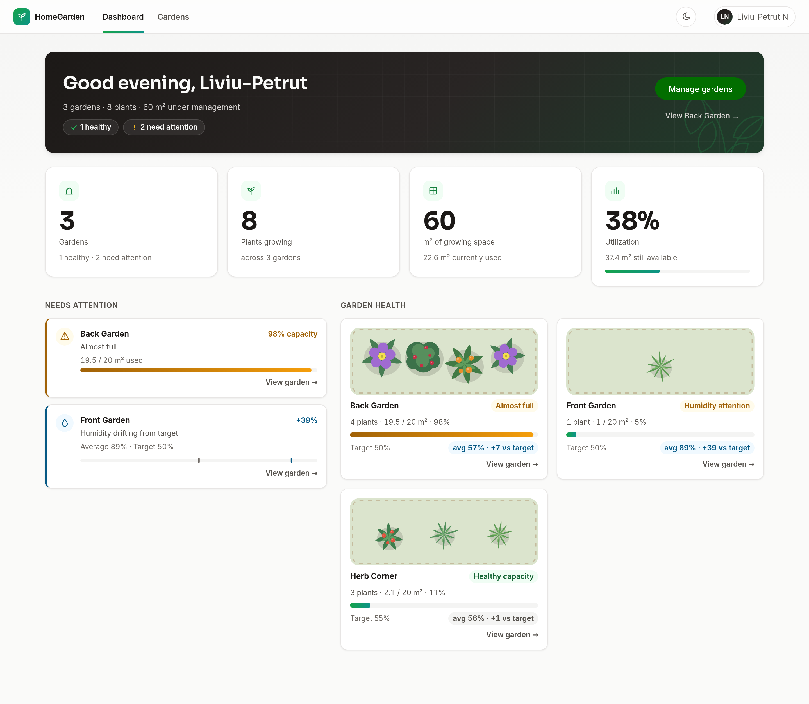
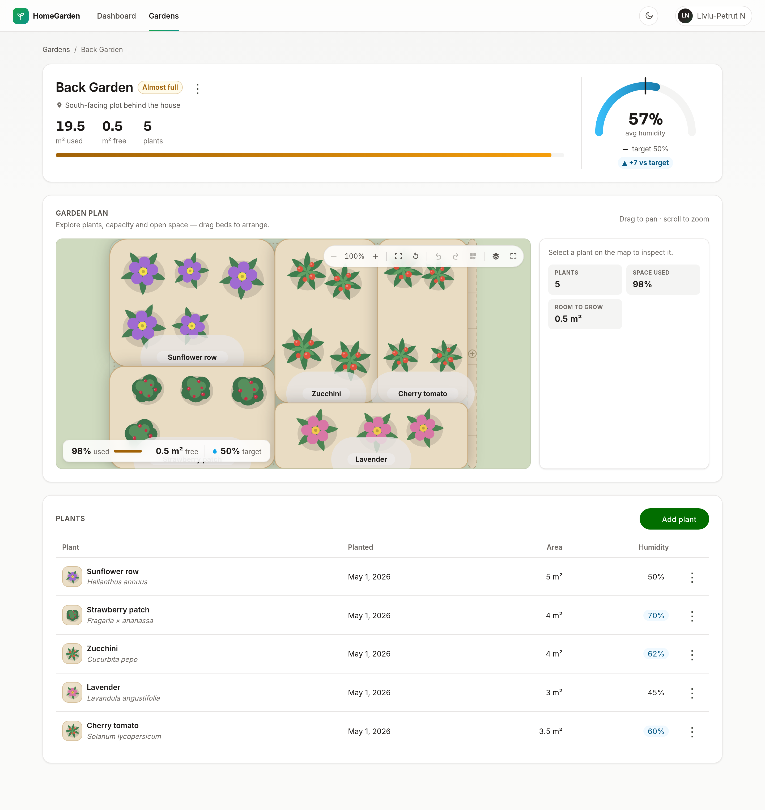

# ItpHomeGarden — Full-Stack Case

A garden management UI built on the provided Fastify backend, engineered so the reviewer never _feels_ the intentionally slow, flaky API — while the code makes it obvious we know exactly how hostile it is.

| Dashboard                                            | Garden detail                                         |
| ---------------------------------------------------- | ----------------------------------------------------- |
|  |  |

## Quick start

```sh
npm ci

npm run dev          # backend :3000 and frontend :4200 together (Nx parallel targets)
```

Or in two terminals, if you prefer separate logs:

```sh
npm run dev:api      # Fastify on http://localhost:3000 — Swagger UI at /docs
npm run dev:web      # Angular on http://localhost:4200 — proxies /api → :3000
```

Quality gates — each one is a real command, run before every commit:

```sh
npm run lint         # eslint + prettier across api, web and web-e2e — 0 errors
npm run typecheck    # strict TypeScript + strictTemplates
npm run test         # unit / component suite (Vitest)
npm run build        # production build for web + api, bundle budgets enforced
npm run test:e2e     # Playwright: integration (real API) + mocked (deterministic)
```

> Node ≥ 22.22.3 (or 24/26) per Angular CLI requirements. The workspace is npm —
> `package-lock.json` is authoritative, do not switch package managers.

Development and production configuration, hosting requirements and the release
gate are documented in **[docs/PRODUCTION-READINESS.md](docs/PRODUCTION-READINESS.md)**.

## What was built

**Stack:** Angular 22 (standalone, zoneless, signals) · NgRx SignalStore · Angular Material M3 (heavily themed) · typed Reactive Forms · Vitest. The frontend lives in this Nx workspace as `apps/web`, as the repo suggests. Angular (instead of the suggested React meta-framework) was agreed with the team up front — the role is Angular-focused; see [ADR-001](docs/adr/ADR-001-angular-over-react.md) including a concept map for React reviewers.

All functional requirements are covered: garden CRUD with an overview linked to the active profile, configurable target humidity (0–100) per garden, plant CRUD with all properties, and overcrowding validation with clear error messages — instant client-side feedback _and_ the authoritative server verdict rendered inline.

**Decision docs came first** — architecture, backend audit, coding guidelines, design system, phased plan, and the ADRs were written and committed before the first line of app code:

- [docs/architecture/ARCHITECTURE.md](docs/architecture/ARCHITECTURE.md) — the system design, driven by the backend's hostility
- [docs/architecture/API-INTEGRATION.md](docs/architecture/API-INTEGRATION.md) — integration layering + the backend audit (contracts, quirks, gaps found)
- [docs/CODING-GUIDELINES.md](docs/CODING-GUIDELINES.md) · [docs/design/DESIGN-SYSTEM.md](docs/design/DESIGN-SYSTEM.md) · [docs/PRODUCTION-READINESS.md](docs/PRODUCTION-READINESS.md) · [docs/adr/](docs/adr)

## The interesting part: surviving this API

The backend delays every response by 200–2000 ms and fails 10% of all requests with a random 500 (`slow-api.ts`, `random-errors.ts`). A screen making three calls would visibly fail ~27% of the time. Three cooperating mechanisms in `core/` neutralize this ([ADR-004](docs/adr/ADR-004-resilience-layer.md)):

1. **Retry interceptor** — exponential backoff with full jitter (250 ms base, ×3, 3 s cap, 3 retries) on 5xx/network only, never on 4xx verdicts. Safe for writes _on this API_ because the error plugin fires before any handler runs — documented, with the production-grade answer (idempotency keys) in ADR-005. Failure math after retries: <0.1% per screen.
2. **Stale-while-revalidate QueryCache** — fresh hits render instantly with zero requests; stale hits render instantly and revalidate behind the scenes; misses show skeleton ghosts. Identical in-flight requests are de-duplicated; mutations invalidate by key prefix or write through.
3. **Optimistic mutations** — deletes apply instantly with snapshot rollback + a retry toast on failure. Create/update stay pessimistic on purpose: the server owns validation verdicts the form must render.

Every screen renders one of: cached data, count-realistic skeletons (with appear-delay/min-display timing so nothing flashes or blinks), a designed empty state, or a designed error state. A blank or frozen screen is treated as a bug.

**Performance bonus (theoretical, server-side):** the client cache is the shipped answer; the proposals we'd bring to the backend team are ETag/`If-None-Match` with 304s, pagination + sparse fieldsets, an `?include=plants` batch shape for the dashboard's N+1, `Cache-Control` on stable resources, and hover-prefetch on the client. Each targets "frequently used data" directly.

**Auth bonus:** a working profile-session flow ships today (onboarding on the real `/users` API, `SessionStore` + route guard, profile menu). The real design — httpOnly-cookie sessions vs rotating JWTs, ownership scoping, CSRF, rate limits, idempotency keys — is written up in [ADR-005](docs/adr/ADR-005-authentication.md), with the shipped seams chosen so real auth plugs in with minimal rework.

**One backend change** was made (explicitly allowed): `targetHumidityLevel` added to gardens via a new `migration002` + zod schemas, because the case requires it and the API lacked it ([ADR-003](docs/adr/ADR-003-backend-extension.md)).

## Backend integration & contract coverage

The backend is the source of truth, so it was audited from its own source — routes, zod schemas, services, migrations, Bruno collection and `/docs` — and then probed with live requests rather than trusted from documentation. The full inventory is in **[docs/backend/BACKEND-API-AUDIT.md](docs/backend/BACKEND-API-AUDIT.md)**, and the per-endpoint UX obligations (loading, empty, validation, business failure, 404, 5xx, network, retry, cancellation, duplicate submit, race) in **[docs/backend/API-UX-STATE-MATRIX.md](docs/backend/API-UX-STATE-MATRIX.md)**.

Headlines:

- **15 / 15** meaningful user-facing endpoints are used by the frontend, and **17 / 17** writable fields are reachable from a form. One endpoint (`GET /plants/{plantId}`) is deliberately not surfaced — the list response already carries the same rows — and that choice is documented in code.
- **Five capabilities the API exposed but the UI had never used** now ship: edit profile (`PUT /users/{id}`), delete profile (`DELETE /users/{id}`), duplicate-email recovery via `GET /users/email/{email}` (a 409 becomes "continue as that profile" instead of a dead end), stale-session detection on boot, and the optional `age` field.
- **Three contract bugs found and fixed**: `plantationDate` lost a calendar day in any timezone east of UTC (verified: 10 Sep picked in `Europe/Brussels` stored as 9 Sep); a slow garden response could land in the store as a _different_ garden (no request-generation guard on a 200–2000 ms API); and a random 500 was rendered as "Garden not found", telling 10% of users their garden had been deleted. Each has a regression test.
- **Backend limitations are documented, not worked around silently** — no capacity check on `PUT /gardens/{id}` (shrinking below occupancy returns 200), `updatedAt` never updated, plants of a missing garden answer 400 rather than 404, no pagination or user scoping on `GET /gardens`. Each entry states the frontend mitigation and the production-grade server fix.

Measured latency behind those decisions (60 live `GET /gardens`): p50 **1083 ms**, p95 **1877 ms**, 10 injected 500s — see [PERFORMANCE-AND-CACHING.md](docs/architecture/PERFORMANCE-AND-CACHING.md).

## The showcase: an interactive Garden Map

Garden Detail centers on a **digital twin** of the garden: a top-down, pannable, zoomable scene — lawn, tilled soil, raised beds — where every plant renders as original botanical vector art inside a footprint whose **visual area is proportional to its real `surfaceAreaRequired`** (a 20 m² garden with a 5 m² lavender bed _looks_ a quarter full; big plants grow into deterministic clusters, still one plant in every number). Artwork is resolved from names/species by a pure presentational resolver with the domain `plantType` as fallback — imagery never touches capacity math. Free soil renders as dashed "room to grow"; an empty garden is an invitation ("Your garden has space to grow." + CTA), not a blank; a full one wears a quiet "Full" badge. A glass HUD shows capacity, free space and the **target** humidity (never fake "current" readings — the halo tint is explicitly a configuration hint). Clicking or keyboard-selecting a plot opens an inspector with the plant's share, humidity-vs-target delta and Edit/Remove.

Why it's more than eye candy on _this_ backend: the layout is a **pure, deterministic function** of `(garden, plants)` — seeded by plant ids, no randomness — so a 2-second revalidation can never rearrange the garden under the user, and the same garden looks identical on every visit.

The architecture is the part built to be read ([ADR-007](docs/adr/ADR-007-garden-visualization-engine.md)):

- **Renderer choice**: PixiJS v8 + pixi-viewport were evaluated seriously and **rejected with data** — for a scene of tens of plots, SVG matches the visual quality with a ~100 kB-smaller chunk, native design-token/dark-mode support, real focusable plant nodes (no `aria-hidden` canvas + parallel DOM), jsdom-testable units and Playwright-assertable output. The exit strategy is real: the renderer consumes a plain view model, so swapping it for Pixi later touches one component.
- **Boundary discipline**: layout (`garden-map-layout.ts`) and camera (`map-camera.ts`) are pure TS with 25 specs (determinism, order-independence, area-honesty, clamping); the SignalStore owns business state, the map owns only UI state (selection, camera); HUD numbers come from the same domain functions the forms use.
- **Lazy by default**: the map ships in its own `@defer (on viewport; prefetch on idle)` chunk (~12 kB gz after the planner features) behind a dimension-matched ghost, so the screen's critical content never waits for the showcase.
- Create/edit forms gained **smart presets** (garden size, target humidity, plant area) via one reusable typed chip component — product-level suggestions that write through the form controls, so validators and server verdicts stay authoritative.

The map is also a **planner** ([docs/design/INTERACTIVE-GARDEN-UX.md](docs/design/INTERACTIVE-GARDEN-UX.md)): beds can be **dragged into place** (drag-vs-pan threshold, clamped to the garden, amber warning on overlaps) with the arrangement persisted per garden in versioned localStorage — _visual-only by design_: positions never touch capacity math or the backend, and undo/redo (20 steps) plus a confirmed "Reset layout" keep the deterministic auto-layout one click away. A **fullscreen mode**, a five-toggle **layers menu** (labels, footprints, grid, humidity preference — explicitly "preference vs target, not a measurement" — and free space), zoom-dependent label detail, and map search round out the planner. Adding a plant now starts from a **ranked plant catalog**: 27 curated presets scored for _this_ garden by a pure, explainable function (humidity proximity, area fit, variety — each card states its reasons), picking prefills the form without bypassing a single validator, custom plants stay first-class, and the dialog fits 1440×900 with **no internal scroll** (Playwright-asserted). An external plant API was deliberately left as a documented provider seam — the assignment never depends on an API key. A 3D "Explore" mode was evaluated and **deferred with written rationale** (ADR-007): a second renderer re-imports every cost the engine decision rejected, to show the same honest data.

## UI/UX notes

**Async is skeleton-first, everywhere** ([docs/design/ASYNC-UX.md](docs/design/ASYNC-UX.md)): every GET renders content-shaped gray skeletons, and every mutation shows a gray ghost _in place_ — a creation ghost card/row/bed while a POST flies, a localized gray ghost over just the affected row/card/header during PUT, and ghost-confirmed deletes that keep the entity visible (gray, inert) until the server confirms. There are zero spinners in the app, enforced by `npm run check:no-spinners` and asserted in the mutation e2e suite.

The dashboard is a **Smart Garden Control Center**: a dark hero with the derived portfolio line and healthy/attention chips (plus a "view most urgent" shortcut when one exists), four KPI tiles with secondary context, an **Attention Center** of severity-sorted, semantically-accented cards — replaced by a positive "Everything looks healthy" card rather than vanishing — and a **Garden Health** portfolio grid whose cards carry a static botanical mini-preview built from the same resolved artwork as the Garden Map, so a garden looks like itself everywhere. Every number is derived from existing data in `computed()`; nothing is invented, and there are no fake trends.

Gray-first design system ("Verdant") with gradient signatures, built as CSS tokens over a themed Material M3 — including a full **dark mode** shipped as a pure token remap (sun/moon toggle, persisted, `prefers-color-scheme` default) with zero component changes. Skeleton ghosts share one shimmer timeline; the gardens screen adds a **search/sort toolbar whose last-used view is restored**, and hovering a card **prefetches** its detail through the cache so navigation feels instant on a 2-second API. The detail screen carries an animated humidity gauge with target marker (honest "no plants yet" state when unmeasured) and the interactive Garden Map described above. Accent tokens are axe-verified AA in both themes. Everything honors `prefers-reduced-motion`, focus rings are never stripped, state is never color-alone, and type is in `rem`. Details in [docs/design/DESIGN-SYSTEM.md](docs/design/DESIGN-SYSTEM.md).

## Testing

The suite focuses on the logic that earns its keep (per the case: _useful_ coverage of critical business logic): the SWR cache semantics (fresh/stale/miss/de-dup/invalidation, fake timers), the retry policy (retries transient 500s, never retries verdicts, exhausts its budget), the error taxonomy mapping, the domain math mirroring the server's overcrowding rule (including edit semantics), and store behaviour (skeleton→data, cached instant render, optimistic rollback with per-entity re-entrancy guards, functional verdicts returned to forms — asserted as behaviour, not implementation). Playwright runs as two projects: **integration** flows against the real slow/flaky backend (create→detail→plant→capacity, edit-without-double-count, delete lifecycles, validation, malformed deep links) and a **mocked** project for the states randomness can't guarantee — persistent 500s with retry-recovery, guaranteed-slow reads asserting skeleton→content stability, duplicate-submit prevention, empty states — plus axe-core WCAG scans (both themes) and keyboard/mobile smoke.

## Running it in production

```sh
npm run build:web                     # → apps/web/dist/web/browser  (hashed, optimized, no source maps)
node tools/serve-dist.mjs --port 4300 # preview it exactly as a static host would
```

The build is a plain static bundle, so a production host has to do exactly two things —
both demonstrated by `tools/serve-dist.mjs`, which is a preview harness, not a deployment target:

1. **SPA fallback** — serve `index.html` for unknown paths, or a hard refresh on
   `/gardens/1` returns 404 from the file server. (Angular routing is client-side; this is a
   hosting requirement, not an app bug.)
2. **Same-origin `/api`** — reverse-proxy `/api/*` to the Fastify backend. The app ships a
   _relative_ `apiBaseUrl`, which keeps requests first-party and means the provided backend
   needs no CORS policy. Deploying the API on another origin is supported by changing one
   constant (`src/environments/environment.production.ts`) and enabling CORS server-side.

`index.html` must not be cached; hashed assets can be cached forever. Full details, including
the recommended security headers and what is deliberately _not_ configured, are in
[docs/PRODUCTION-READINESS.md](docs/PRODUCTION-READINESS.md).

## What I'd do next (deliberately cut)

CI pipeline wiring (`nx affected` + the axe/e2e suites on PRs), i18n runtime (strings are centralized-ready), real auth per ADR-005, a server-side capacity check on garden updates (the client warns today — see API-INTEGRATION.md proposals), an optional 3D "Explore" mode and an external plant-catalog provider behind the existing seams (both deferred with rationale — ADR-007, INTERACTIVE-GARDEN-UX.md), and visual-regression snapshots (deliberately skipped: font rendering differs across the machines this case will run on, making screenshot comparisons flaky without a pinned CI image).

## AI usage

AI tooling was used as pair-programmer for scaffolding and iteration, per the case's AI policy. Every architectural decision, guideline and trade-off is documented in `docs/` and owned; the commit history tells the story step by step.
